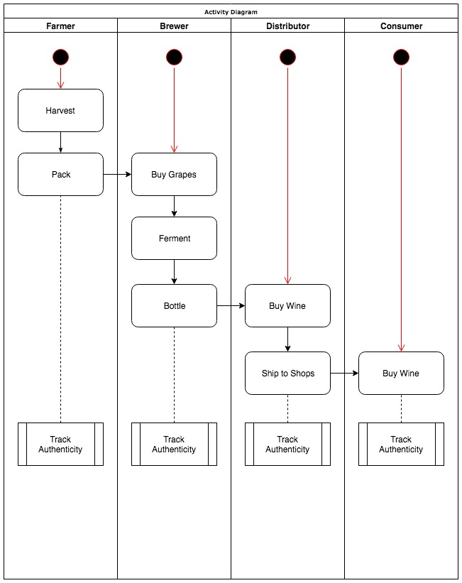
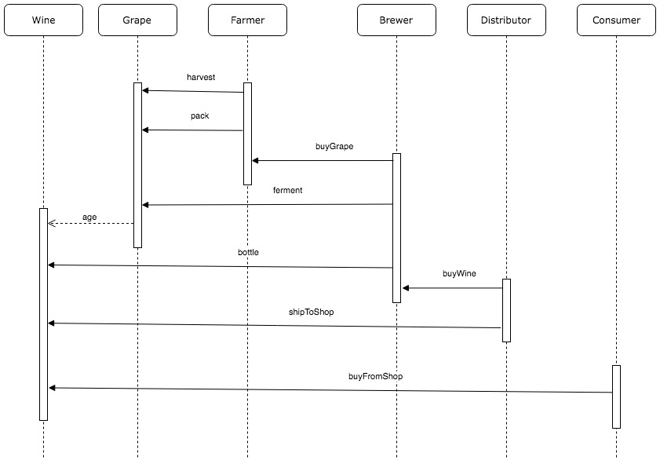
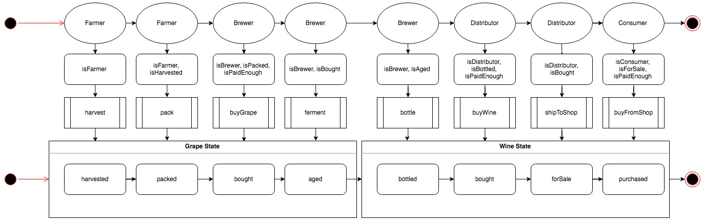
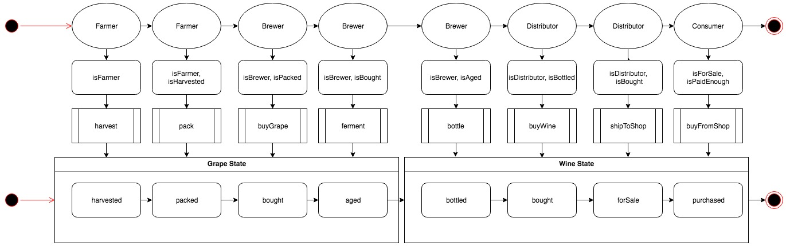
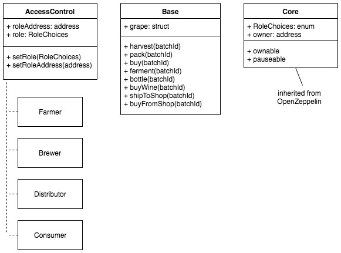
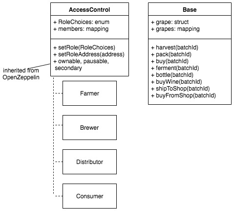

# Demo Project - Wine Supply Chain Dapp

## UML

Below is the original UML diagrams for the project. During the project some changes have been made, the changes are noted in each of the diagram section.

### Activity Diagram



### Sequence Diagram



### State Diagram

After consideration, during buying from brewer and distributor, it is impractical to use Ether to pay. As such, the requirement `isPaidEnough` is removed from both the brewer and distributor.

Everyone can also be a consumer, anyone should be able to buy the end product. As such, the restriction of `isConsumer` is removed.

##### Original



##### After Modification



### Class Diagram

After consideration, it might seem that the Core contract is redundant as it only contains inheritance from OpenZeppelin Secondary, Pausable and Ownable. As we also need the function `onlyOwner` in the AccessControl, the inheritance is done in the AccessControl.

Instead of separate contract, `members` and `grapes` mapping are implemented to keep track of roles and grapes.

```
AccessControl is Ownable, Pausable, Secondary
Base is AccessControl
```

##### Original



##### After Modification



## Frameworks and Tools 

```
Truffle v5.0.13 (core: 5.0.13)
Solidity - 0.5.2 (solc-js)
Node v8.10.0
Web3.js v1.0.0-beta.37
openzeppelin-solidity ^2.2.0
```

OpenZeppelin library is used as it simplifies the development of common access control, it has been tested by many and is believed to be stable.

## Restrictions on Functionality

1. Only owner can add roles (however, for the purpose of testing, another function is created so anyone can add role)
2. 1 address can only have 1 role

## Installation

1. Download/clone this repo

`git clone https://github.com/albertsundjaja/dapp_wine_supplychain.git`

2. For testing in Rinkeby, put in your infura and mnemonic in truffle-config.js

```
const mnemonic = "YOUR MNEMONIC";
const infuraUrl = "YOUR INFURA URL";
```

3. go to the app folder

`cd dapp_wine_supplychain/app`

4. run the dev server

`npm run dev`

5. use your browser to access the frontend

`http://localhost:8080`

#### Running blockchain locally

2. Run Ganache. The setting is expecting ganache to be running on localhost port 7545

3. go to the cloned folder and use truffle to deploy
`truffle migrate --reset --network ganache`

*note*: it has been found that sometimes we need to delete the build folder containing the abi for proper frontend functionality. `build/contracts`

3. run the dev server

`npm run dev`

4. use your browser to access the frontend

`http://localhost:8080`

